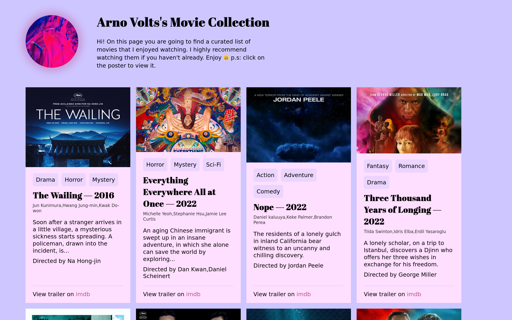

# Table of contents
- [The Collection](#the-collection)
- [Implementation Details](#implementation-details)
- [Takeaway](#takeaway)

# The Collection


A single webpage containing some of my favorite movies.
It was a challenge given by BeCode, whose goal was to summarize our knowledge of:
- HTML & CSS
- Responsive Design
- Javascript Basics
- The DOM

# Implementation Details
The data for movies is stored inside a `json` file called `movies.json`.
Containing an array movies, each movie is an object with the following structure: 
```json
{
    "title": "Nope",
    "releaseYear": 2022,
    "director": [
        "Jordan Peele"
    ],
    "cast": [
        "Daniel kaluuya",
        "Keke Palmer",
        "Brandon Perea"
    ],
    "genre": [
        "Action",
        "Adventure",
        "Comedy"
    ],
    "poster": {
        "src": "https://m.media-amazon.com/images/M/MV5BMGIyNTI3NWItNTJkOS00MGYyLWE4NjgtZDhjMWQ4Y2JkZTU5XkEyXkFqcGdeQXVyNjY1MTg4Mzc@._V1_.jpg",
        "alt": "Jordan Peele, Keke Palmer, Daniel Kaluuya, and Steven Yeun in Nope (2022)"
    },
    "plot": "The residents of a lonely gulch in inland California bear witness to an uncanny and chilling discovery.",
    "trailer": "https://www.imdb.com/video/vi1273872921/?playlistId=tt10954984&ref_=tt_ov_vi"
}
```
The file is fetched across the network via the fetch API, for each movie in the array a card component is generated through a call to `createCard(movieObject)` and added into the web page:
```javascript
async function getMovies() {
    const response = await fetch("./assets/js/movies.json");
    const moviesJson = await response.json();

    for(let movie of moviesJson.movies){
        document.querySelector(".cards-container")
            .appendChild(createCard(movie));
    }
} 
```
# Takeaway
It was a fun project to work on, and it allowed me to experiment with all parts of frontend work. From designing the webpage and coding it. It revealed certain blindspots in my project planning. That I'll be actively working on.

